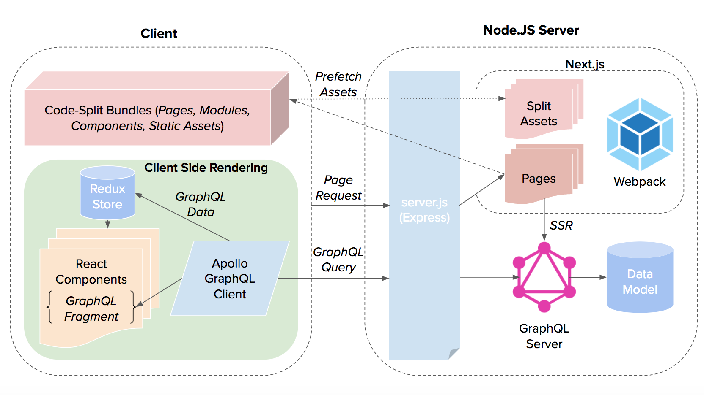

# friilii - P2P Insurance Community for Freelancers
With the rise of the Gig Economy, the number of freelancers in Singapore has increased. However, this means that a larger proportion of our population do not enjoy the same benefits which the "traditionally-employed" do, such as sick leave, medical insurance and transport claims.

friilii is Singapore's first P2P insurance community that allows you to purchase insurance to insure yourself against loss of income, medical emergencies, or transport claims.

## Tech Stack:
### Server
- Express
- [GraphQL](https://graphql.org/) (As it was my first time working with GraphQL, I chose to define the Schema from Scratch instead of using the various tools out there, such as [graphql-tools](https://github.com/apollographql/graphql-tools), [Prisma.io](https://www.prisma.io) in order to get a better understanding of the fundamentals of GraphQL.)

### Front-End
- React

### Architecture Overview

  

## Getting Started
To run locally, get API keys and add to env
1. [Google Maps API (optional)](https://developers.google.com/maps/documentation/static-maps/intro)

Installation
1.	Ensure that you have yarn/npm installed on your local machine, otherwise install yarn/npm.
2.	Run `yarn init`
3.  `Yarn add all` – to install all dependencies found in package.json file
4.  `Yarn run dev` to run the development server

## User Stories
- As a freelancer, I want to be able to insure myself against loss of income through sickness/accident.
- As a user, I want to be able to quickly check the price to insure myself for daily income of a certain amount.
- As a user, I want to join a group of reliable workers(Community) to keep my premiums low (ie. WeWork community @ XYZ).
- As a admin, I want to be able to validate MCs to give payouts to the users.

## ERD
TODO : Add In ERDs 

## Wireframes
TODO : Add in Wireframes
### Landing Page Wireframe

  

